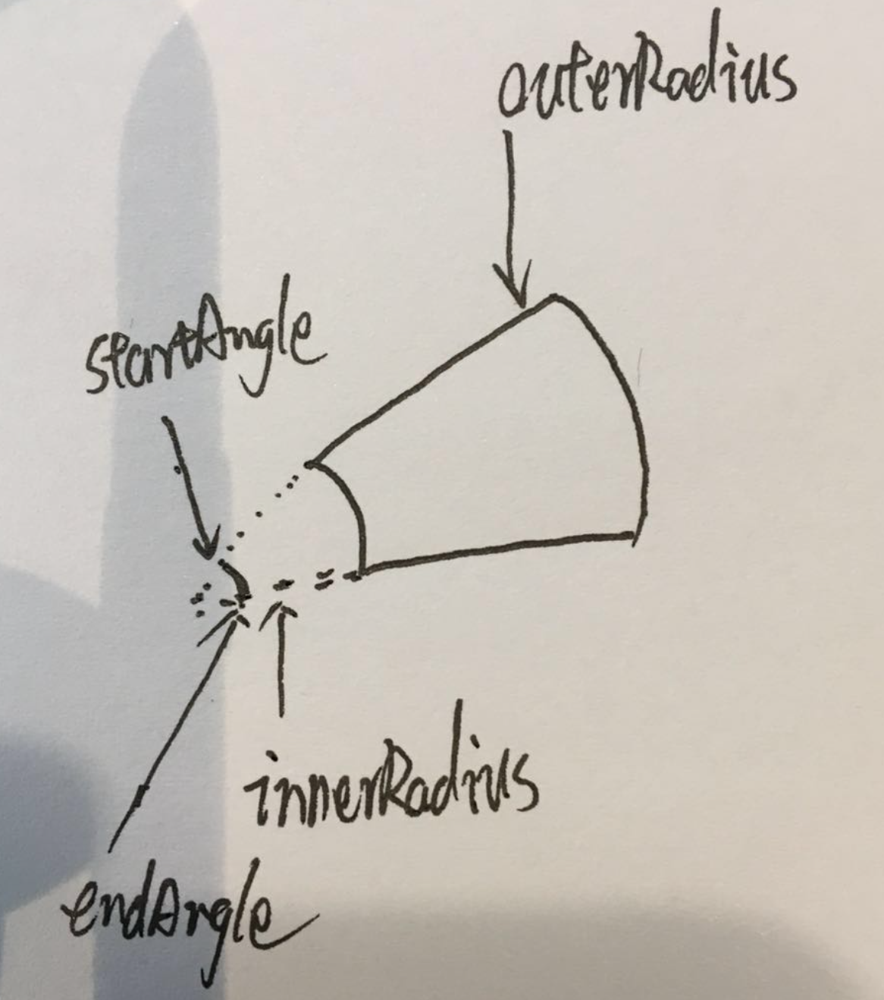

## 1. 画个圆

在画大屏之前，我们首先来画一个基础的饼图。不要小看它，须知，万事万物起始都是从一个圆开始的。 我们画圆需要用到的第一个方法就是d3-shape模块下面的[d3.arc方法](https://github.com/d3/d3-shape/blob/v1.3.7/README.md#arc)。
d3.arc(arguments..)

## 文档参考

- [Echarts](https://echarts.apache.org/zh/index.html)
- [Zrender](https://ecomfe.github.io/zrender-doc/public/)
- [AntV G2](https://antv.vision/zh)
- [G](https://www.yuque.com/antv/ou292n/dgh2o7)
- [G2 Canvas or SVG](https://g2.antv.vision/zh/docs/manual/tutorial/renderer)
- [使用 Canvas 或者 SVG 渲染](https://echarts.apache.org/zh/tutorial.html#%E4%BD%BF%E7%94%A8%20Canvas%20%E6%88%96%E8%80%85%20SVG%20%E6%B8%B2%E6%9F%93)